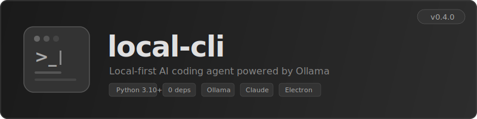
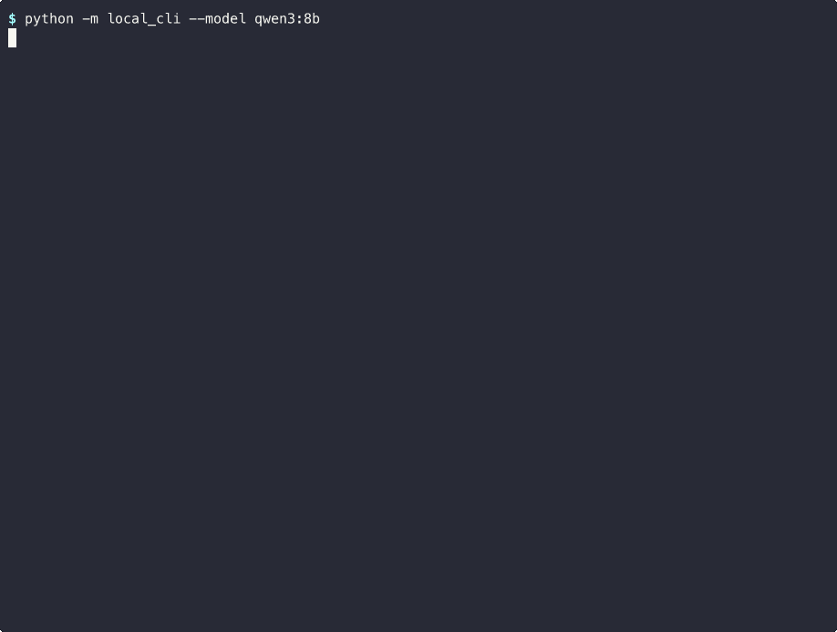
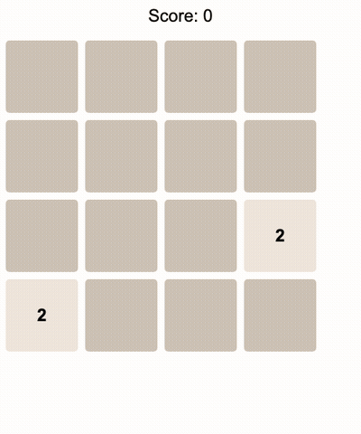

<p align="center">
  
</p>

<p align="center">
  <strong>Local-first AI coding agent. Zero dependencies. Runs entirely on your machine.</strong>
</p>

<p align="center">
  <a href="#download">Download</a> &nbsp;·&nbsp;
  <a href="#features">Features</a> &nbsp;·&nbsp;
  <a href="#desktop-app">Desktop App</a> &nbsp;·&nbsp;
  <a href="#cli-usage">CLI Usage</a> &nbsp;·&nbsp;
  <a href="#configuration">Configuration</a>
</p>

---

<p align="center">
  
</p>

<p align="center">
  
</p>
<p align="center"><em>AI agent autonomously creates a 2048 game — write tool in action</em></p>

<p align="center">
  
</p>
<p align="center"><em>The resulting game — fully playable in the browser</em></p>

---

## What is this?

Local CLI is an AI coding agent that runs locally using [Ollama](https://ollama.com). It can read, write, and edit files, run shell commands, search code, and fetch web pages — all through natural language.

It also supports [Claude API](https://console.anthropic.com/) as an alternative provider, with seamless runtime switching between local and cloud models.

Think of it as a local, offline-capable alternative to cloud-based AI coding assistants.

---

## Features

### Agent Loop
The LLM autonomously calls tools to complete tasks. It reads files, writes code, runs commands, and iterates until the task is done — no manual step-by-step prompting required.

### 9 Built-in Tools

| Tool | Description |
|------|-------------|
| `bash` | Run shell commands (with dangerous command blocking) |
| `read` | Read file contents with line numbers |
| `write` | Create or overwrite files (with path validation) |
| `edit` | Find-and-replace editing |
| `glob` | Find files by pattern (`*.py`, `**/*.ts`) |
| `grep` | Search file contents with regex |
| `web_fetch` | Fetch and parse web pages |
| `ask_user` | Ask the user a question |
| `agent` | Spawn sub-agents for parallel task execution |

### Multi-Provider
- **Ollama** — Local inference, no API key, full privacy
- **Claude API** — Anthropic's cloud models (Opus, Sonnet, Haiku)
- Switch providers at runtime with `/provider` command or the desktop UI

### Model Management
- **40+ curated models** across 6 categories: Code, General, Small, Reasoning, Japanese, Multilingual
- **Live search** from ollama.com with filters (tools, vision, thinking, code)
- Install, delete, and switch models from CLI or desktop app
- Interactive TUI model picker (`/models` or `--select-model`)

### RAG Engine
Index your codebase for context-aware responses. Uses SQLite + embeddings with automatic re-indexing on file changes.

### Git Checkpoints
Create tagged snapshots before risky edits. Roll back instantly with `/rollback`.

### Session Persistence
Save conversations as JSONL files. Resume where you left off.

### Security
- Dangerous command blocking (rm -rf /, fork bombs, etc.)
- Environment sanitization (strips API keys, tokens from subprocesses)
- Path traversal prevention
- Ollama host validation (localhost only)

### Desktop GUI
Electron app with terminal-style UI, model picker, file explorer, and settings panel.

### Zero Dependencies
Python stdlib only. No `pip install` needed for the core CLI.

---

## Download

### Desktop App (pre-built)

Download the latest release from **[GitHub Releases](https://github.com/lutelute/local-cli/releases)**:

| Platform | File |
|----------|------|
| macOS (Apple Silicon) | `Local CLI-x.x.x-arm64.dmg` |
| Windows | `Local CLI Setup x.x.x.exe` |
| Linux | `Local CLI-x.x.x.AppImage` |

> [Ollama](https://ollama.com) must be installed and running on your machine.

#### macOS: "App is damaged" warning

The app is not code-signed. To allow it:

```bash
xattr -cr /Applications/Local\ CLI.app
```

Or: **System Settings > Privacy & Security > Open Anyway**.

### CLI (from source)

```bash
# Requirements: Python 3.10+, Ollama, Git
git clone https://github.com/lutelute/local-cli.git
cd local-cli

# Run directly
python -m local_cli

# Or install as a command
pip install -e .
local-cli
```

---

## CLI Usage

### Quick Start

```bash
# Default model (qwen3:8b)
local-cli

# Choose a model at startup
local-cli --select-model

# Use a specific model
local-cli --model qwen3:8b

# Enable RAG for codebase-aware responses
local-cli --rag --rag-path ./src

# Use Claude API
export ANTHROPIC_API_KEY=sk-ant-...
local-cli --provider claude
```

### Slash Commands

| Command | Description |
|---------|-------------|
| `/help` | Show available commands |
| `/model <name>` | Switch model |
| `/models` | Open interactive model selector (TUI) |
| `/provider [name]` | Switch or show LLM provider |
| `/status` | Show connection and model info |
| `/install <model>` | Download a model from Ollama registry |
| `/uninstall <model>` | Delete a model |
| `/info <model>` | Show model details and capabilities |
| `/running` | List models currently loaded in VRAM |
| `/checkpoint [msg]` | Create a git checkpoint |
| `/rollback [tag]` | Roll back to a checkpoint |
| `/save` | Save current session |
| `/brain [model]` | Set orchestrator brain model |
| `/registry` | Show task-to-model routing |
| `/update` | Check for and install updates |
| `/agents` | List background sub-agent status |
| `/plan` | Show, create, or manage structured plans |
| `/ideate` | Enter brainstorming / ideation mode |
| `/knowledge` | Save, load, or list knowledge items |
| `/skills` | List or show discovered skills |
| `/clear` | Clear conversation |
| `/exit` | Quit |

> See **[docs/prompts.md](docs/prompts.md)** for copy-paste prompt examples.

---

## Skills

Local CLI has a skills system that auto-injects contextual instructions based on trigger keywords. Create `SKILL.md` files in `.agents/skills/` to encode team conventions, framework guides, or domain knowledge.

```
.agents/skills/
├── django-api/
│   └── SKILL.md      # triggers: [django, REST API, DRF]
└── code-review/
    └── SKILL.md      # triggers: [review, PR, code quality]
```

> See **[docs/skills.md](docs/skills.md)** for the full guide.

---

## Desktop App

Terminal-style GUI with streaming chat, model management, and file browsing.

### Features
- **Streaming chat** with real-time tool call display
- **Thinking indicator** — see when the AI is processing
- **Model picker** — Catalog (curated) + Discover (live search from ollama.com)
- **Provider switching** — Toggle between Ollama and Claude
- **File explorer** — Browse project files in the sidebar
- **File viewer** — Preview files without leaving the app
- **Settings panel** — App and backend updates, keyboard shortcuts
- **Copyable output** — Select and copy any text from the terminal
- **Stop generation** — Interrupt AI responses mid-stream

### Keyboard Shortcuts

| Shortcut | Action |
|----------|--------|
| `Cmd/Ctrl + ,` | Settings |
| `Cmd/Ctrl + B` | Toggle file explorer |
| `Escape` | Stop generation / Close dialog |
| `Shift + Enter` | New line in input |
| `Enter` | Send message |

### Auto-Update

The desktop app updates automatically on startup:

1. Checks GitHub Releases for new versions
2. Downloads the update in the background
3. Closes the app, replaces itself, and relaunches — zero user interaction

Manual update is also available from the Settings panel (`Cmd/Ctrl + ,`).

### Run from Source

```bash
cd desktop
npm install
npm run dev          # Development mode (hot reload)
```

### Build Installers

```bash
cd desktop
npm run build        # Build for current platform
npm run build:mac    # macOS (.dmg + .zip)
npm run build:win    # Windows (NSIS installer)
npm run build:linux  # Linux (AppImage + .deb)
```

---

## Configuration

Configuration is resolved in order: **CLI flags > environment variables > config file > defaults**.

| Flag | Env Var | Default | Description |
|------|---------|---------|-------------|
| `--model` | `LOCAL_CLI_MODEL` | `qwen3:8b` | Model to use |
| `--provider` | `LOCAL_CLI_PROVIDER` | `ollama` | LLM provider |
| `--debug` | `LOCAL_CLI_DEBUG` | `false` | Debug output |
| `--rag` | — | `false` | Enable RAG |
| `--rag-path` | — | `.` | Directory to index |
| `--rag-topk` | — | `5` | RAG results per query |
| `--rag-model` | — | `all-minilm` | Embedding model |
| `--select-model` | — | `false` | Interactive model picker |
| `--server` | — | `false` | JSON-line server mode |
| `--update` | — | `false` | Check for updates |

Config file location: `~/.config/local-cli/config` (key=value format).

### Claude API

Set the `ANTHROPIC_API_KEY` environment variable to enable Claude as a provider:

```bash
export ANTHROPIC_API_KEY=sk-ant-api03-...
local-cli --provider claude
```

Switch at runtime with `/provider claude` or `/provider ollama`.

---

## Recommended Models

| Model | Size | Best For |
|-------|------|----------|
| `qwen3:8b` | 5.2 GB | General use, tool calling |
| `qwen2.5-coder:7b` | 4.7 GB | Code generation |
| `qwen3:30b` | 18.5 GB | Complex reasoning |
| `deepseek-r1:14b` | 9.0 GB | Chain-of-thought |
| `gemma3:12b` | 8.1 GB | Multilingual, Japanese |
| `qwen3:0.6b` | 0.5 GB | Quick testing |

---

## Architecture

```
local-cli/
├── local_cli/
│   ├── __main__.py              # Entry point
│   ├── agent.py                 # Agent loop (LLM ↔ tools)
│   ├── cli.py                   # REPL + slash commands
│   ├── config.py                # Configuration (CLI > env > file > defaults)
│   ├── server.py                # JSON-line server for desktop GUI
│   ├── ollama_client.py         # Ollama REST API client
│   ├── orchestrator.py          # Multi-provider orchestration
│   ├── model_catalog.py         # 40+ curated models + cache
│   ├── model_search.py          # Live search from ollama.com
│   ├── model_manager.py         # Install / delete / info
│   ├── model_registry.py        # Task-to-model routing
│   ├── model_selector.py        # Interactive TUI picker
│   ├── rag.py                   # RAG engine (SQLite + embeddings)
│   ├── git_ops.py               # Git checkpoint / rollback
│   ├── session.py               # Session persistence (JSONL)
│   ├── security.py              # Input validation + sanitization
│   ├── updater.py               # Self-update (git pull)
│   ├── sub_agent.py             # Sub-agent runner (thread pool)
│   ├── plan_manager.py          # Structured plan management
│   ├── knowledge.py             # Persistent knowledge store
│   ├── skills.py                # Skill discovery & matching
│   ├── providers/
│   │   ├── base.py              # Abstract LLMProvider
│   │   ├── ollama_provider.py   # Ollama adapter
│   │   ├── claude_provider.py   # Claude API adapter
│   │   ├── message_converter.py # Format normalization
│   │   └── sse_parser.py        # SSE streaming parser
│   └── tools/                   # 8 agent tools
│       ├── bash_tool.py         # Shell execution
│       ├── read_tool.py         # File reading
│       ├── write_tool.py        # File creation
│       ├── edit_tool.py         # String replacement
│       ├── glob_tool.py         # File pattern search
│       ├── grep_tool.py         # Content search (regex)
│       ├── web_fetch_tool.py    # URL fetching
│       └── ask_user_tool.py     # User prompts
├── desktop/                     # Electron + React + Vite
│   ├── electron/                # Main process + preload
│   ├── src/                     # React UI components
│   └── build/                   # App icons
├── tests/                       # 961 tests
└── pyproject.toml               # Zero dependencies
```

## Tests

```bash
python -m pytest tests/ -q
# 961 passed
```

---

## License

MIT
